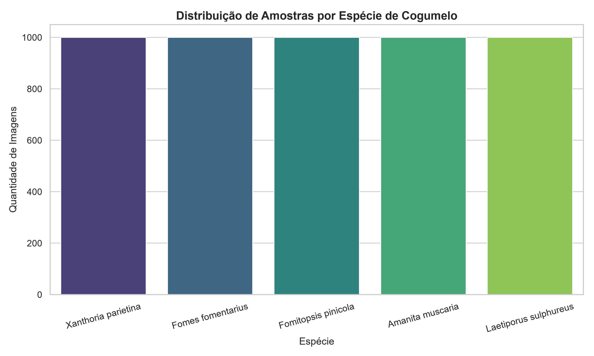
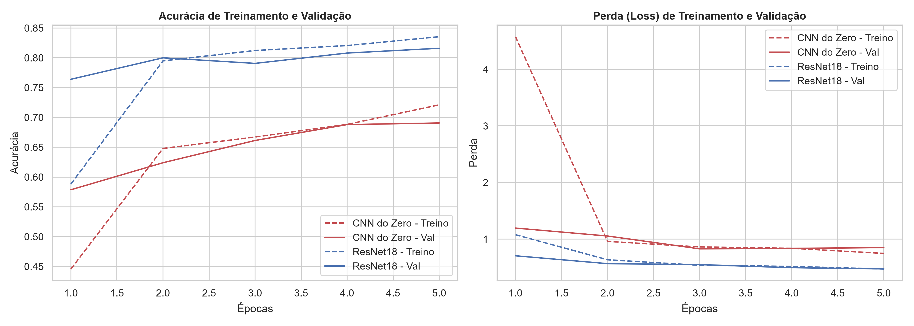
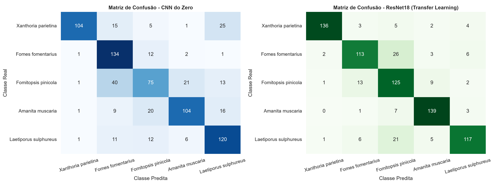

# Relatório - Classificação de Cogumelos (Combined Kaggle Mushrooms Dataset)

## 1. Abordagem e Amostragem

Este projeto aborda o problema de classificação multiclasse de imagens de cogumelos utilizando o *Combined Kaggle Mushrooms Dataset*. O dataset completo original contém mais de 100.000 imagens e 555 espécies.

Para priorizar a eficiência no tempo de processamento, usei as 5 espécies mais frequentes no dataset e fiz uma amostragem estratificada de 1.000 imagens por classe, totalizando 5.000 imagens. As classes selecionadas são:
1. `Xanthoria parietina` (Liquen amarelo comum)
2. `Fomes fomentarius` (Fungo casco de cavalo)
3. `Fomitopsis pinicola` (Políporo de borda vermelha)
4. `Amanita muscaria` (Cogumelo icônico vermelho com pintas brancas)
5. `Laetiporus sulphureus` (Fungo prateleira de enxofre)

Treinei e comparei dois modelos no conjunto de dados preparado:
- **Modelo 1 (CNN do Zero)**: Rede Neural Convolucional simples projetada e inicializada do zero.
- **Modelo 2 (ResNet18 - Transfer Learning)**: Rede clássica pré-treinada no ImageNet, com os pesos extratores de características congelados, onde treinei apenas a nova camada de classificação de saída.

---

## 2. Análise Exploratória dos Dados (EDA)

O dataset ficou muito balanceado, contendo exatamente 1.000 imagens para cada uma das 5 espécies selecionadas.

Abaixo estão exemplos reais das imagens de cada espécie:

---

## 3. Pré-Processamento e Justificativas

As imagens originais encontram-se em formato WebP e tamanhos variados. O pipeline de pré-processamento foi estruturado no PyTorch:

1. **Divisão Estratificada**: Dividi os dados em **70% para Treino (3.500 imagens)**, **15% para Validação (750 imagens)** e **15% para Teste (750 imagens)**. O uso de estratificação garantiu que cada uma das divisões mantenha a mesma proporção de 20% para cada espécie.
2. **Redimensionamento**: Todas as imagens foram redimensionadas para `128x128` pixels.
3. **Data Augmentation**: Apenas para as imagens do conjunto de treinamento, apliquei rotações aleatórias de até 15 graus, flips horizontais/verticais e leve alteração de brilho e contraste. Isso faz a rede neural ver variações de orientação e luminosidade e melhora a generalização.
4. **Normalização**: Apliquei a conversão para Tensor e normalizei os canais RGB com a média (`[0.485, 0.456, 0.406]`) e o desvio padrão (`[0.229, 0.224, 0.225]`) oficiais do ImageNet.

---

## 4. Implementação e Treinamento dos Modelos

Ambos os modelos foram treinados por **5 épocas** usando o otimizador **Adam** (taxa de aprendizado inicial $10^{-3}$), a função de perda **CrossEntropyLoss** e um batch size de **64**. O treinamento foi acelerado por GPU em uma NVIDIA GeForce RTX 5060 Ti via CUDA 13.0, levando menos de 2 minutos no total.

- **Modelo 1 (CNN do Zero)**: Contém duas camadas convolucionais (`32` e `64` filtros $3 \times 3$, com *Batch Normalization* e ativação *ReLU*), cada uma seguida de *Max Pooling* $2 \times 2$. Apliquei *Dropout* de 30% na camada densa achatada, seguida por uma camada oculta linear com 128 neurônios e a camada final linear com 5 neurônios de saída.
- **Modelo 2 (ResNet18 - Transfer Learning)**: Carreguei o modelo ResNet18 com os pesos pré-treinados no ImageNet. Congela todos os parâmetros das convoluções e substituí a camada classificadora de saída por uma camada densa que conecta as 512 características extraídas às 5 classes de destino.

Abaixo está o histórico de desempenho ao longo das épocas de treinamento:

---

## 5. Avaliação e Comparação dos Resultados

Os modelos foram avaliados no conjunto de teste independente (750 imagens que nunca foram vistas durante o treinamento).

| Modelo | Acurácia Global | F1-Score (Macro) | F1-Score (Weighted) |
|---|---:|---:|---:|
| CNN do Zero | 71,60% | 71,42% | 71,42% |
| ResNet18 (Transfer Learning) | **84,00%** | **84,18%** | **84,18%** |

### Matrizes de Confusão

matrizes de confusão dos dois modelos lado a lado:

### Análise dos Resultados

1. **CNN do Zero (Acurácia: 71,60%)**: 
   - Mostrou uma excelente capacidade de aprender estruturas visuais em apenas 5 épocas.
   - Observando a matriz de confusão, os erros mais frequentes ocorreram entre `Fomes fomentarius` e `Fomitopsis pinicola`.
   
2. **ResNet18 - Transfer Learning (Acurácia: 84,00%)**:
   - Superou consideravelmente o modelo treinado do zero (+12.4% de acurácia).
   - O uso de Transfer Learning permitiu aproveitar filtros visuais de textura, cantos e cores muito genéricos.
   - Teve excelente desempenho em classes bem distintas, como `Amanita muscaria` e `Xanthoria parietina`.
   - Assim como a CNN do zero, a sua maior confusão ainda foi classificar `Fomitopsis pinicola` como `Fomes fomentarius`.

---

## 6. Dificuldades e Limitações

1. **Processos Multiprocessados no Windows**: O PyTorch por padrão usa múltiplos subprocessos (`num_workers > 0`) no dataloader. No ambiente Windows/Jupyter, os subprocessos falhavam ao tentar serializar e importar a classe `MushroomDataset` declarada no próprio notebook. A dificuldade foi superada definindo `num_workers=0`, garantindo a execução estável em uma única thread.
2. **Limitação de Amostragem**: Amostrar 1.000 imagens por classe das 5 espécies principais ajudou a reduzir o tempo de treinamento, mas em uma aplicação prática real de identificação, o modelo precisa lidar com o desbalanceamento de dados e cobrir as centenas de outras espécies de cogumelos do dataset original. O modelo treinado seria incapaz de reconhecer espécies que estão fora das 5 classes.

---

## 7. Conclusão

O projeto atingiu os objetivos propostos. A técnica de **Transfer Learning** utilizando a **ResNet18** mostrou-se melhor que **CNN do Zero**, alcançando **84,00% de acurácia** contra **71,60%**. O uso de Transfer Learning economizou tempo de computação e provou ser o método mais adequado para problemas de classificação de imagens com amostras moderadas.
