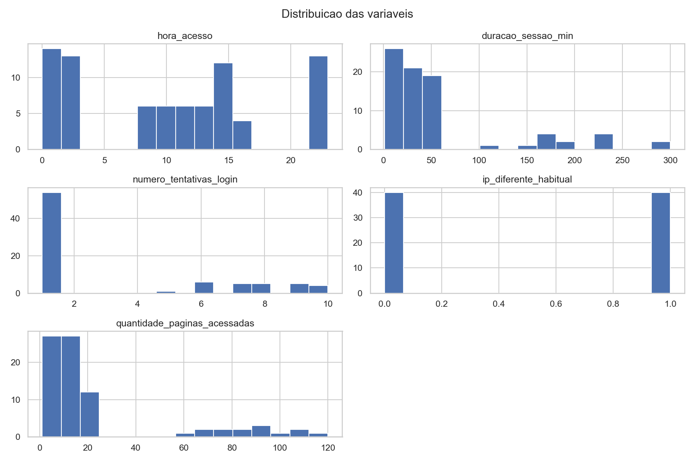
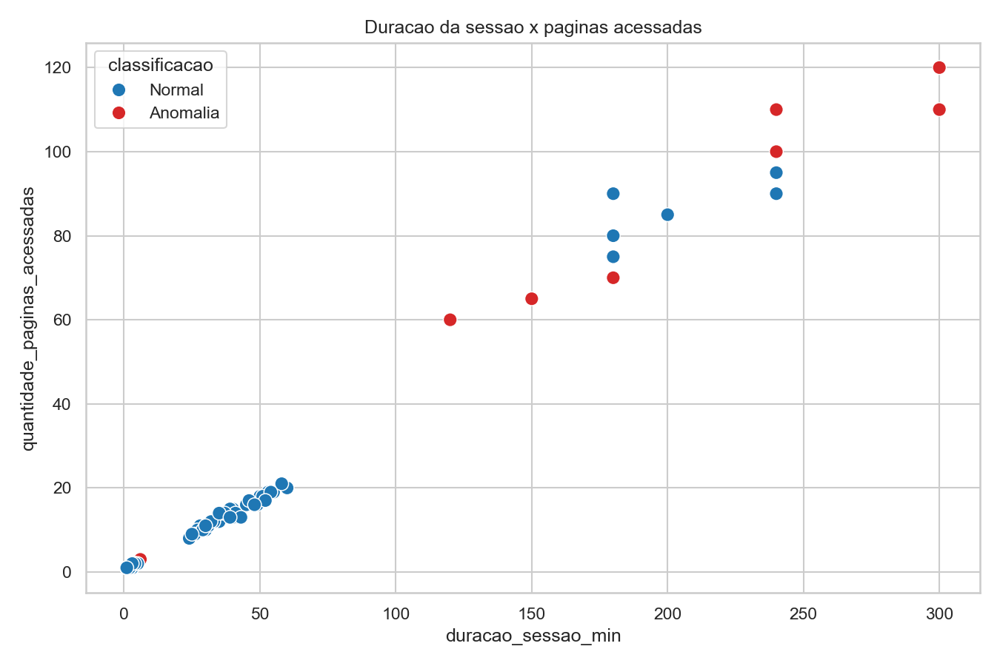
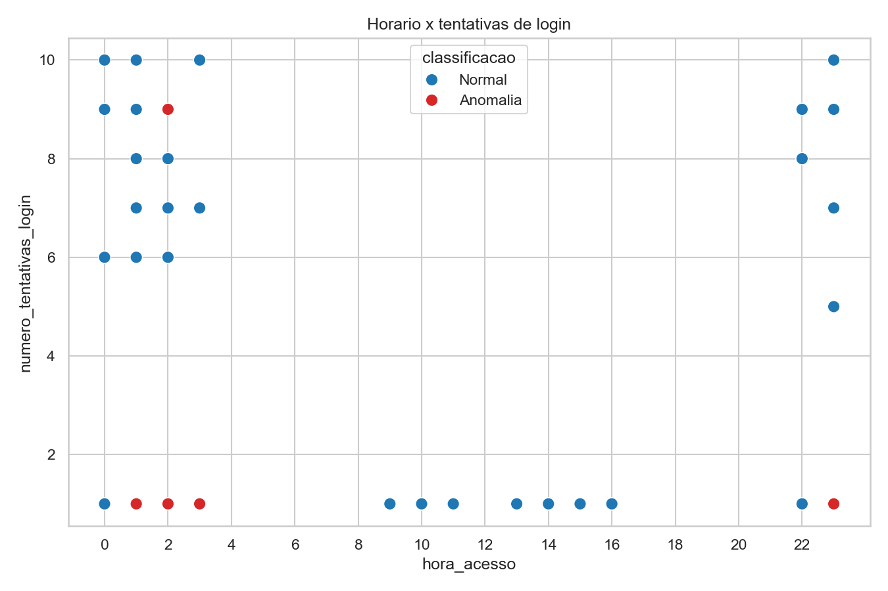

# Relatorio - Deteccao de anomalias em logs

## 1. Abordagem

Foi utilizado o algoritmo Isolation Forest para identificar acessos fora do
padrao sem a necessidade de rotulos.

As etapas realizadas no notebook foram:

1. Leitura e exploracao do dataset.
2. Selecao das cinco variaveis numericas.
3. Padronizacao dos dados com `StandardScaler`.
4. Treinamento do Isolation Forest.
5. Identificacao e visualizacao das anomalias.

O modelo foi configurado com 100 arvores, `random_state=42` e
`contamination=0.10`. Esse ultimo parametro informa que aproximadamente 10% dos
registros devem ser classificados como anomalos.

## 2. Exploracao dos dados

O arquivo fornecido possui 80 registros, embora o enunciado mencione 100.
Nao existem valores ausentes e foi encontrado um registro duplicado.

Os acessos com IP habitual apresentam um comportamento mais concentrado:

- horarios entre 9h e 16h;
- uma tentativa de login;
- sessoes entre 24 e 60 minutos;
- entre 8 e 21 paginas acessadas.

Os acessos com IP diferente ocorrem principalmente entre 22h e 3h. Nesse grupo
existem sessoes muito curtas com varias tentativas de login e sessoes muito
longas com grande quantidade de paginas.

## 3. Resultados

O modelo classificou 8 dos 80 registros como anomalias.

Todos os acessos sinalizados ocorreram durante a noite e utilizaram um IP
diferente do habitual. Foram observados dois perfis:

- 7 sessoes longas, entre 120 e 300 minutos, com 60 a 120 paginas acessadas;
- 1 sessao curta, com 9 tentativas de login.

As sessoes longas podem indicar coleta automatizada ou acesso excessivo a
informacoes. As sessoes curtas com varias tentativas podem estar relacionadas a
tentativas de descoberta de senha.

## 4. Questoes propostas

### Quais padroes foram considerados normais?

O modelo considerou principalmente como normais os acessos realizados durante o
dia, com IP habitual, uma tentativa de login, duracao moderada e quantidade
intermediaria de paginas acessadas.

### Quais caracteristicas aparecem nas anomalias?

As caracteristicas mais frequentes foram:

- acesso entre 22h e 3h;
- IP diferente do habitual;
- sessao muito longa e muitas paginas acessadas;
- varias tentativas de login em uma sessao curta.

### Todas as anomalias representam um problema de seguranca?

Nao. O modelo identifica comportamentos diferentes, mas nao conhece o contexto
do usuario. Uma sessao longa pode ser uma tarefa administrativa, e um acesso
noturno pode ser realizado por um funcionario autorizado.

Por isso, os registros devem ser investigados antes de qualquer bloqueio ou
conclusao.

### Quais falsos positivos podem ocorrer?

Alguns exemplos sao:

- trabalho ou manutencao fora do horario;
- acesso durante uma viagem;
- uso autorizado de VPN;
- mudanca de provedor ou IP dinamico;
- exportacao legitima de muitos dados;
- erro no registro do horario.

### Como usar o modelo em um sistema real?

O modelo poderia analisar novos logs e gerar uma pontuacao de risco. Os acessos
mais atipicos seriam enviados para uma equipe de seguranca.

Em um ambiente real, o resultado deveria ser combinado com informacoes como
usuario, cargo, dispositivo, localizacao e historico de acessos. O retorno dos
analistas tambem poderia ser usado para ajustar o modelo.

## 5. Conclusao

O Isolation Forest permitiu identificar acessos fora do padrao sem utilizar
rotulos. Os resultados fazem sentido porque os registros sinalizados combinam
horario incomum, IP diferente, sessoes excessivamente longas ou muitas
tentativas de login.

Mesmo assim, anomalia nao significa ataque. O modelo deve ser utilizado como
apoio para priorizar investigacoes, sempre com avaliacao humana e informacoes
adicionais do sistema.
