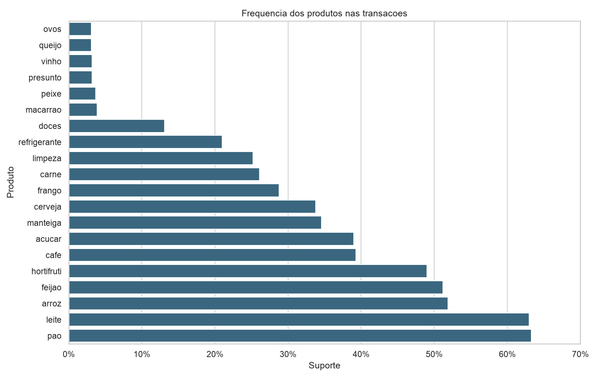
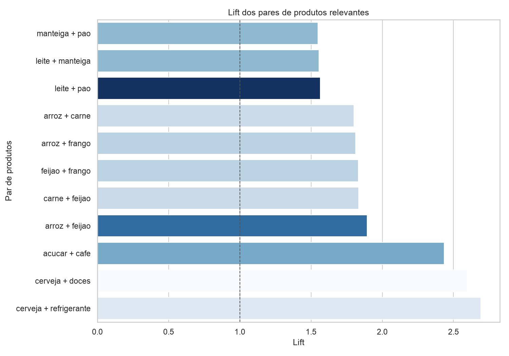
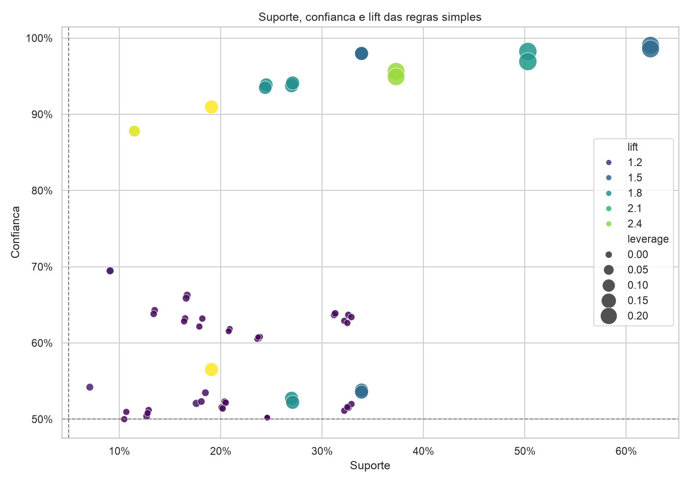

# Relatorio - Market Basket Analysis em supermercado

## 1. Resumo executivo

Foi aplicado o algoritmo Apriori ao historico de 1.000 transacoes para
identificar produtos comprados em conjunto. A analise encontrou quatro blocos
com forte relevancia comercial:

- pao, leite e manteiga;
- arroz, feijao, carne e frango;
- cafe e acucar;
- cerveja, refrigerante e doces.

As regras mais robustas combinam volume e intensidade de associacao. Por
exemplo, arroz e feijao aparecem juntos em 50,3% das transacoes, enquanto cafe
e acucar aparecem juntos em 37,3%. Refrigerante e cerveja possuem suporte menor
(19,1%), mas uma associacao proporcionalmente mais intensa, com lift de 2,69.

## 2. Abordagem

As etapas realizadas no notebook foram:

1. Leitura e validacao do dataset.
2. Analise da frequencia dos produtos e do tamanho das cestas.
3. Conversao das colunas de produtos para valores booleanos.
4. Aplicacao do Apriori para extrair conjuntos frequentes.
5. Geracao das regras de associacao.
6. Analise de suporte, confianca, lift, leverage e conviction.
7. Selecao de regras simples e interpretaveis para o negocio.
8. Exportacao das tabelas e visualizacoes.

Foram utilizados suporte minimo de 5%, confianca minima de 50% e tamanho maximo
de quatro produtos por conjunto. Para a selecao gerencial, foram mantidas
regras com um produto no antecedente, um no consequente e lift minimo de 1,20.

## 3. Exploracao dos dados

O arquivo possui 1.000 transacoes e 20 produtos. Nao existem valores ausentes,
identificadores repetidos ou valores diferentes de 0 e 1 nas colunas de
produtos.

Foram observados 500 padroes de cesta distintos. Isso nao significa que metade
dos registros deva ser removida: transacoes diferentes podem legitimamente
conter a mesma combinacao de produtos. Como os identificadores sao unicos e nao
ha informacao adicional que caracterize erro de coleta, todas as transacoes
foram preservadas.

A cesta media possui 5,60 produtos. Existem 16 transacoes sem produtos
marcados; elas foram mantidas no denominador porque representam registros do
arquivo e afetam corretamente o suporte global.

Os produtos mais frequentes foram:

| Produto | Frequencia |
|---|---:|
| pao | 63,3% |
| leite | 63,0% |
| arroz | 51,9% |
| feijao | 51,2% |
| hortifruti | 49,0% |
| cafe | 39,3% |
| acucar | 39,0% |
| manteiga | 34,6% |
| cerveja | 33,8% |

Produtos com frequencia inferior a 5%, como macarrao, peixe, ovos, queijo,
presunto e vinho, nao atingiram o suporte minimo. Essa decisao evita conclusoes
baseadas em poucas compras.

## 4. Resultados das regras

### Associacoes mais relevantes

| Regra | Suporte | Confianca | Lift |
|---|---:|---:|---:|
| refrigerante -> cerveja | 19,1% | 91,0% | 2,69 |
| doces -> cerveja | 11,5% | 87,8% | 2,60 |
| acucar -> cafe | 37,3% | 95,6% | 2,43 |
| cafe -> acucar | 37,3% | 94,9% | 2,43 |
| feijao -> arroz | 50,3% | 98,2% | 1,89 |
| arroz -> feijao | 50,3% | 96,9% | 1,89 |
| carne -> feijao | 24,5% | 93,9% | 1,83 |
| frango -> feijao | 27,0% | 93,8% | 1,83 |
| frango -> arroz | 27,1% | 94,1% | 1,81 |
| carne -> arroz | 24,4% | 93,5% | 1,80 |
| manteiga -> leite | 33,9% | 98,0% | 1,56 |
| leite -> pao | 62,4% | 99,0% | 1,56 |

O lift compara a ocorrencia conjunta com o que seria esperado caso os produtos
fossem independentes. Um lift de 2,69 para refrigerante e cerveja indica que a
combinacao ocorre aproximadamente 2,69 vezes mais do que seria esperado ao
acaso, dadas as frequencias individuais.

## 5. Respostas das questoes orientadoras

### Quais produtos apresentam maior associacao entre si?

Considerando simultaneamente volume e lift, os pares mais importantes sao:

- arroz e feijao;
- pao e leite;
- cafe e acucar;
- refrigerante e cerveja;
- carne ou frango com arroz e feijao;
- manteiga com pao e leite;
- doces com cerveja.

Refrigerante e cerveja apresentam o maior lift entre os pares com suporte
relevante. Arroz e feijao apresentam o maior suporte conjunto depois de pao e
leite, alem de lift elevado.

### Existem produtos que funcionam como ancora para outras compras?

Sim. Pao e leite funcionam como ancoras de trafego por aparecerem em mais de
63% das transacoes e manterem forte ligacao entre si e com manteiga.

Arroz e feijao funcionam como ancoras de cestas de refeicao. Alem da alta
frequencia, eles se associam fortemente a carne e frango.

Cerveja pode funcionar como ancora de ocasiao de consumo. Quando ha cerveja, o
refrigerante aparece em 56,5% das cestas; quando ha refrigerante, a cerveja
aparece em 91,0%. A assimetria ocorre porque cerveja e mais frequente que
refrigerante no dataset.

### Quais regras possuem maior potencial para acoes promocionais?

As melhores candidatas sao:

- cafe + acucar: alto suporte, alta confianca e lift de 2,43;
- arroz + feijao: grande alcance e possibilidade de kits basicos;
- carne ou frango + arroz + feijao: promocao por ocasiao de refeicao;
- cerveja + refrigerante: lift de 2,69 e suporte de 19,1%;
- cerveja + doces: associacao forte, embora com alcance menor;
- pao + leite + manteiga: grande alcance para cupons cruzados.

Descontar simultaneamente produtos que ja seriam comprados juntos pode reduzir
margem sem gerar volume incremental. Por isso, as promocoes devem ser testadas
com grupo de controle, preferencialmente oferecendo desconto no consequente
apenas a clientes que compram o antecedente.

### Alguma regra pode ser enganosa ou pouco util?

Sim. A regra `arroz -> pao` possui confianca de 63,4%, mas lift de apenas 1,001.
Ela parece forte porque pao ja aparece em 63,3% de todas as transacoes. Na
pratica, comprar arroz quase nao altera a probabilidade de comprar pao.

Tambem e perigoso selecionar regras somente pelo lift. O par queijo e presunto,
por exemplo, possui lift aproximado de 3,02, mas aparece em apenas 3 das 1.000
transacoes. Ele foi excluido pelo suporte minimo de 5%, pois a evidencia e
insuficiente para uma decisao ampla.

### Como os resultados podem impactar o layout e as estrategias de venda?

Recomendacoes praticas:

- criar pontos de venda cruzada para cafe e acucar;
- aproximar arroz e feijao e usar comunicacao de receitas junto a carnes;
- criar exposicoes tematicas para cerveja, refrigerante e acompanhamentos;
- manter pao, leite e manteiga visiveis e usar sinalizacao cruzada, respeitando
  refrigeracao e fluxo operacional;
- oferecer cupons personalizados no produto complementar;
- usar os itens-ancora para conduzir o fluxo, sem afastar produtos a ponto de
  prejudicar a experiencia;
- testar cada mudanca por loja e periodo antes da expansao.

## 6. Limitacoes

O dataset nao possui data, preco, quantidade, margem, cliente, loja ou categoria
da promocao. Assim, as regras mostram coocorrencia, nao causalidade.

Tambem nao e possivel medir sazonalidade, recorrencia por cliente ou retorno
financeiro. Antes de executar uma promocao, a gerencia deve combinar as regras
com margem, estoque, validade, restricoes para bebidas alcoolicas e capacidade
operacional.

## 7. Conclusao

O Apriori identificou associacoes coerentes e acionaveis. Os grupos arroz e
feijao, pao e leite, cafe e acucar e cerveja e refrigerante concentram as
melhores oportunidades.

As recomendacoes mais promissoras sao promocoes cruzadas, exposicoes por ocasiao
de consumo e cupons personalizados. A decisao final deve considerar lift e
suporte em conjunto e ser validada por experimentos, evitando confundir alta
confianca com ganho real de probabilidade.
